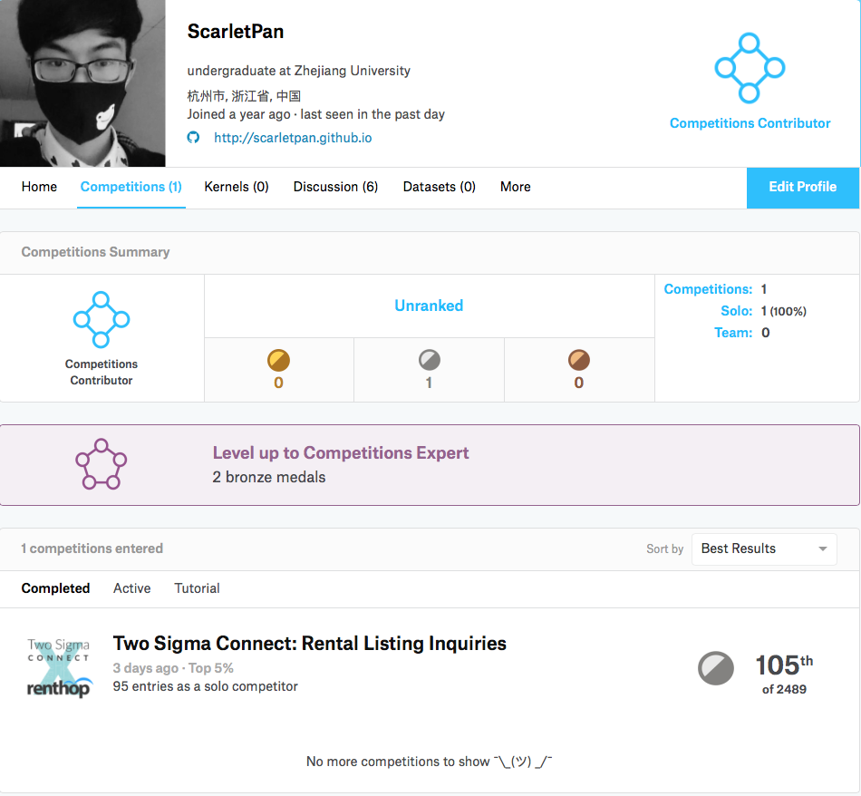
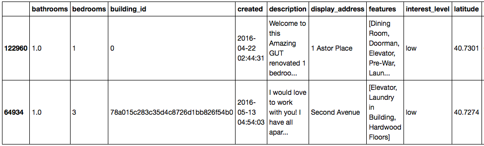
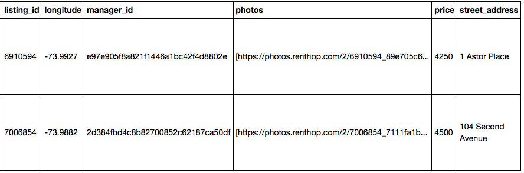
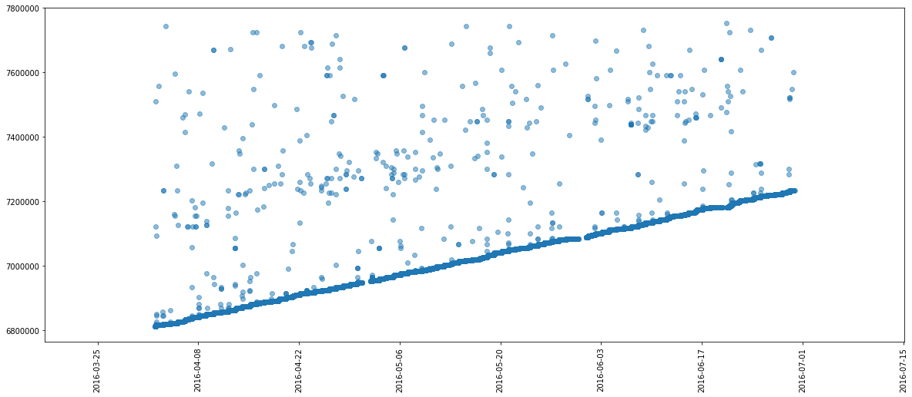

> 在这篇博客开始之前，我必须感谢@[Prof. Cai](http://www.cad.zju.edu.cn/home/dengcai/)
给我提供服务器资源，@[fenixlin](http://fenixlin.github.io)
学长从他自身经验出发耐心地为我解答一些困惑，素未谋面的@[dnc1994](https://dnc1994.com)学长的一篇非常优秀的[博文](https://dnc1994.com/2016/04/rank-10-percent-in-first-kaggle-competition/)帮助入门，
以及广大Kaggler的无私分享，我确实在Kaggle举行的这场[Rental Listing Inquiries](https://www.kaggle.com/c/two-sigma-connect-rental-listing-inquiries)
比赛中收益良多，获得了不少知识。作为一个大三学生第一次参加，获得了Top 5%的成绩已经让我非常满意了。


<p></p>
&emsp;&emsp;这篇文章的目的是介绍自己第一次参加Kaggle的心历路程，总结遇到的问题和解决思路，为自己以后参赛做准备。同时这篇文章也可以作为一个初学者的入门Kaggle的参考，如果想要在入门kaggle的时候拿到一个好的名次，可以参考我的一些方法实践。本文可以随意转载，但务必**注明出处和作者**, 并且发邮件(myscarlet@sina.com)通知与我。

### &emsp;目录

* [初识Kaggle](#1)
* [Step 1: 数据探索和可视化（EDA）](#2)
* [Step 2: 提取基础特征+模型训练](#3)
* [Step 3: 跑出一个能提交的结果](#4)
* [Step 4: 特征工程（FE）](#5)
* [Step 5: 模型调参（Grid Search）](#6)
* [Step 6: 模型融合](#7)
* [Tricks](#8)
* [总结](#9)


<p>&emsp;&emsp;</p>

### <h2 id="1"> 初识Kaggle </h2>
#### 什么是Kaggle
&emsp;&emsp;从刚接触machine learning的时候就有在学长口中、博文中、社区中听到过它的名字，当初我对它的理解还比较浮浅，只是知道是一个数据比赛的平台，有很多公开的数据集，比如大二寒假做的第一个ML练手项目就是一个用word2vec进行情感分析的Tutorial级[比赛](https://www.kaggle.com/c/word2vec-nlp-tutorial/data)，并且写了一个[research report](http://o6qr23o6z.bkt.clouddn.com/paper%20for%20sentiment%20analysis.pdf)。就只用到了教程和数据集。
<p>&emsp;&emsp;后来重新接触Kaggle才发现，它的价值所在是各种高质量的比赛，以及每场比赛下面的社区讨论（包括比赛中的分享、答疑，和比赛后的top solution分享），因此如果想要获得关于数据挖掘，机器学习实战经验的话，打一场kaggle比赛绝对是一个高回报的工作。</p>
<p>&emsp;&emsp;因为还是学生，不知道kaggle比赛究竟是否会为自己求职工作有举足轻重的影响，但是单从Kaggle被google收购一点来看，它会在行业内一点点提升影响力的。</p>
#### 比赛组织
&emsp;&emsp;一场比赛通常持续2～3个月，在比赛的简介中会有规则、评价指标（比如这场比赛为mlogloss），时间轴等信息。另外还有数据区、Kernel区（一些Kagglers在kaggle上成功运行的ipython notebook或者代码），Discussion（讨论区），LeaderBoard（LB，分为公开的用户提交可以显示结果的榜单，和非公开的比赛结束后确定最终排名的榜单），当然还有提交区（一般为一定格式的csv文件提交）。
<p>&emsp;&emsp;另外就是奖牌问题，一般来讲在1000+量级的比赛中，top 10+ 0.2%为金牌，5%为银牌，10%为铜牌，[这里](https://www.kaggle.com/progression)有更具体的奖牌发放方式。</p>
#### 讨论区
&emsp;&emsp;个人认为，如果想在入门Kaggle阶段就获得一个好的成绩的话，关注discussion是非常重要的，会有很多人分享自己的思路、困惑甚至代码和结果。有时候，一场比赛中比较关键的feature可能就是从讨论区中获得的，比如[Rental Listing Inquiries](https://www.kaggle.com/c/two-sigma-connect-rental-listing-inquiries)这场比赛的最后几天，我以为自己特征提取得已经差不多了，没有任何idea了的时候，一个来自讨论区magic feature从天而降，从而使得榜单大变，一夜之间我的排名从70多掉到了120多。


### <h2 id="2"> 数据探索和可视化（EDA） </h2>
&emsp;&emsp;首先拿到一个比赛题目，你需要下决心是否参加这个比赛，对我个人而言最重要的无非两点1. 是不是有rank point，也就是奖牌， 2. 数据集是否令我满意。 因此对数据的探索首先需要你从Kaggle网站上查看数据的简介，并把数据下载下来。比如[Rental Listing Inquiries](https://www.kaggle.com/c/two-sigma-connect-rental-listing-inquiries)包含了80G的图片数据，和几份json文件。
<p>&emsp;&emsp;我们将下载下来的train.csv用python pandas 打开，取少量样本进行观测</p>

``` python
In [1]: import pandas as pd
In [2]: train = pd.read_json("input/train.json")
In [3]: train.sample(2)
```

<p>

<p>&emsp;&emsp;抛开图片数据不谈，我们可以看到给定的数据里包含多种多样的feature：

* 数值型feature
  * bathrooms
  * bedrooms
  * price
* 高势集类别（High Categorical）型feature
  * building_id
  * display_address
  * manager_id
  * street_address
* 时间型feature
  * created
* 地理位置型feature
  * longitude
  * latitude
* 文本feature
  * description
* 稀疏特征集feature
  * features
* id型feature
  * listing_id
  * index

<p>&emsp;&emsp;我们看到有这么多不同的feature，一看几乎每个feature都有深度挖掘的价值，何况还有80G的图片feature，无疑是让人兴奋的，因此我选择了这个比赛，因为它的数据集的确让我舒心。</p>
<p>&emsp;&emsp;另外一定要搞明白的一件事是这场比赛是一个预测比赛还是分类比赛，我们能看到最重要预测的是用户的interest_level，分为low，medium，high三级，很显然是个分类问题了。</p>
<p>&emsp;&emsp;接下来的是就是对数据进行可视化探索了，我因为是初期参赛的，所以自己做了一份可视化方案，从中可以发现很多有趣的分布、outlier等。在这里推荐三份在比赛中分享出来的比较好的EDA：</p>

* [Simple Exploration Notebook](https://www.kaggle.com/sudalairajkumar/two-sigma-connect-rental-listing-inquiries/simple-exploration-notebook-2-connect)
* [Two Sigma RentHop EDA](https://www.kaggle.com/poonaml/two-sigma-connect-rental-listing-inquiries/two-sigma-renthop-eda)
* [Data Exploration Two Sigma Renthop](https://www.kaggle.com/neviadomski/two-sigma-connect-rental-listing-inquiries/data-exploration-two-sigma-renthop)

<p>&emsp;&emsp;一般的比赛初期就会有人共享出他的数据可视化方案，因此如果是新手的话，初期不必浪费时间在这上面，因为从别人的kernel中就能发现很多东西了。</p>
<p>&emsp;&emsp;然而，需要强调的是，EDA的过程并不是在初期进行后以后都不做了，在以后的不断找新的feature的时候，EDA会给予你灵感。本人的一个关键feature就是在后期重新做了一些可视化后获得的。</p>
### <h2 id="3"> 提取基础特征+模型训练 </h2>
<p>&emsp;&emsp;有了之前数据探索的基础，我们很快能提取到一些基础的feature，比如数值型feature进行简单的加减乘除，类别型feature用id顺序编码，稀疏特征集用one-hot编码，时间特征生成年、月、日等。将一些基础的特征转换成相应的输入input_X矩阵后，再将label也转换成数值形式：</p>

``` python
in [2]: target_num_map = {'high':0, 'medium':1, 'low':2}
in [3]: y = data["interest_level"].apply(lambda x: target_num_map[x])
```

<p>&emsp;&emsp;懂机器学习的人都知道，有了这些(X，y)对，我们就可以进行模型训练了。</p>
<p>&emsp;&emsp;我们用cross-validation（CV）的成绩来判断我们本地的实验结果，也就是将（X，y）训练集拆分成训练和验证集，训练相应分类器对训练集拟合，再在验证集上进行loss的计算来评估模型的好坏。</p>
<p>&emsp;&emsp;常见的分类器有Logistic Classifier，SVM， NN softmax，Random Forest等。但是在kaggle上用的比较多的还是一些封装好的库，如sklearn里的各种分类器，大名鼎鼎的xgboost，最近崭露头角的lightgbm等。</p>
<p>&emsp;&emsp;早就听闻xgboost的好用，我就直接在电脑上pip了xgboost，作为我接下来一两个月以来的核心分类器。将原先的（X，y）对中的训练部分输入xgboost进行fit，然后用验证部分predict计算mlogloss。</p>
<p>&emsp;&emsp;至此为止，比赛初期的第一个模型就已经训练好了。</p>
### <h2 id="4"> 跑出一个能提交的结果 </h2>
<p>&emsp;&emsp;训练完一个比较好的模型之后，就可以对测试集进行预测了，首先将训练集（X，y）对输入xgboost中重新训练，然后对测试集也像对训练集一样进行特征处理，预测出来的结果按照比赛指定的格式保存到文件（在这里还是建议用pandas），即可提交。</p>
<p>&emsp;&emsp;第一次提交意味着你正式进入比赛，提交的结果会在Leader Board上显示你当前的排名，当然这个排名只起到参考作用，因为你提交上去的大部分结果kaggle都没有进行评估。</p>
### <h2 id="5"> 特征工程（FE） </h2>
&emsp;&emsp;在一系列的初始操作以后，你就要踏上FE的漫漫长征了。本人断断续续在数据清洗、特征提取上做了约两个多月，在比赛最后一段时间模型融合完毕后还在继续地寻找、测试新的特征。后期评论区中magic feature的出现，让每个人的预测结果好了0.01～0.02个点。不得不说，特征工程才是Kaggle比赛获胜的关键所在，因此初学者耗费大量精力在这上面是没错的。而本博文也是重点想讲一下自己发现新特征的一些心历路程。
<p>&emsp;&emsp;在对一些基础的特征进行生成之后，我开始了漫长地测试特征的长征路，测试的思路我后来发现并不是很好，因为是通过新增加一个或几个feature，如果cv分数上去了，就增加这个feature，如果cv分数没有上去，就舍弃这个feature，也就是相当于贪心验证。这样做的弊处在于，如果之前被舍弃的feature和之后被舍弃的feature联合在一起才会有正面影响，就相当于你错过了两个比较好的feature。因此特征的选择和联合显得非常关键。</p>
<p>&emsp;&emsp;在比赛阶段，花费大量力气去创建一个feature，到头来却选择放弃这个feature的事情很常见，我后期的特征有很多是新添加的，旧有的一些特征并没有保留。接下来就让我总结一下这场比赛中有哪些“好”的feature，为以后的比赛提供灵感和经验。</p>

* **数值型feature的简单加减乘除**
<p>&emsp;&emsp;这个乍一看仿佛没有道理可言，但是事实上却能挖掘出几个feature之间的内在联系，比如这场比赛中提供了bathrooms和bedrooms的数量，以及价格price，合租用户可能会更关心每个卧室的价格，即```bathrooms / price```，也会关心是不是每个房间都会有一个卫生间```bathrooms / price ```，这些数值型feature之间通过算数的手段建立了联系，从而挖掘出了feature内部的一些价值，分数也就相应地上去了。</p>

* **高势集类别**（High Categorical）进行经验贝叶斯转换成数值feature
<p>&emsp;&emsp;什么是High Categorical的特征呢？一个简单的例子就是邮编，有100个城市就会有好几百个邮编，有些房子坐落在同一个邮编下面。很显然随着邮编的数量增多，如果用简单的one-hot编码显然效果不太好，因此有人就用一些统计学思想（经验贝叶斯）将这些类别数据进行一个map，得到的结果是数值数据。在这场比赛中有人分享了一篇[paper](http://helios.mm.di.uoa.gr/~rouvas/ssi/sigkdd/sigkdd.vol3.1/barreca.ps)里面就提到了具体的算法。详细就不仔细讲了，用了这个encoding之后，的确效果提升了很多。那么这场比赛中哪些数据可以进行这样的encoding呢，只要满足下面几点：1. 会重复，2. 根据相同的值分组会分出超过一定数量（比如100）的组。也就是说building\_id, manager\_id, street\_address, display\_address都能进行这样的encoding，而取舍就由最后的实验来决定了。 </p>

* **时间特征**
<p>&emsp;&emsp;针对于时间数据来讲，提取年、月、日、星期等可能还是不够的，有另外一些points可以去思考，用户的兴趣跟发布时间的久远是否有关系？可以构造如下的feature来进行测试：
``` python
data["latest"] = (data["created"]- data["created"].min())
```
``` python
data["passed"] = (data["created"].max()- data["created"])
```
<p>&emsp;&emsp;可以看到latest指的是从有数据开始到该房创建为止一共过去了多少时间，而passed则是该房记录创建为止到最后有记录的时候一共过去了多少时间。</p>
<p>&emsp;&emsp;另外针对于时间特征还可以用可视化的方式来与其他特征建立联系，比如我们观察listing_id与时间变化到底有怎样的联系，能够绘制出如下的图来：</p>



<p>&emsp;&emsp; 可能简单的相除就能获得很好的结果</p>
</p>

* **地理位置特征**
<p>&emsp;&emsp;想到地理位置，就会想到聚类，一个简单的方式将每个房子划分到同一块区域中去；除了聚类以外，算出几个中心点坐标，计算曼哈顿距离或者欧式距离可能都会有神奇的效果。</p>

* **文本特征**
<p>&emsp;&emsp;实话说自己是看中这次比赛中有文本数据才参加的，因此在文本挖掘中做了很大的努力，比如提取关键词、情感分析、word embedding聚类之类都尝试过，但效果都不是很好, 对于文本的特征的建议还是去找出一些除了停用词以外的高频词汇，寻找与这个房屋分类问题的具体联系。</p>

* **图片特征**
<p>&emsp;&emsp;除了最后爆料出来的magic feature(后文会提到)以外，我只用了一个房子有几个照片这个信息。讨论区中都说对于图片特征用CNN提取、简单特征提取之类的效果都不是很好。</p>

* **稀疏特征集**
<p>&emsp;&emsp;其实就相当于一系列标签，不同标签的个数也是挺多的，本次比赛我只是简单地采用了counterEncoding的方式进行one-hot编码。值得一提的是，有些标签是可以合并的，比如cat allowed 和 dog allowed可以合并成为 pet allowed，我在这场比赛中手工地合并了一些feature数据，最终结果略微有所提升。</p>

* **特征重要程度**（feature importance）
<p>&emsp;&emsp;在树结构的分类器比如randomforest、xgboost中最后能够对每个特征在分类上面的重要程度进行一个评估。这时候如果已经选定了一些feature进行训练了之后，查看feature importance的反馈是非常重要的，比如本场比赛制胜的关键是运用manager_id这个feature，而它的feature importance反馈结果也是非常高。通过对重要特征的重新再提取特征，能够发现很多有意思的新特征，这才是用FE打好一场比赛的关键所在。</p>

<p>&emsp;&emsp;下面列出了一些比赛结束后获胜者分享的idea，这大概是我这场比赛中获益最大的一块地方了。</p>
* Top #1 [solution](https://www.kaggle.com/c/two-sigma-connect-rental-listing-inquiries/discussion/32163) @plantsgo
<p> &emsp;&emsp;主要是针对manager\_id生成了非常多的feature。如根据不同时间出现的manager\_id判断一个manager是否活跃（manager与time进行group，manager掌管有几个不同的房子（manager与building_id进行group）、平均每天处理多少房子（比值）、活动范围（同个manager掌管的房子的最大最小经纬度group），经理的开价程度（选择bedroom和bathroom作为房子型号指标，把相同房型的均价来衡量经理对于所有房子的开价程度），对经纬度进行聚类再计算每个区域中有多少个manager竞争、一个manager同时经营几个区域、在同个区域中manager的开价水平等。从Top 1选手分享的代码来看，其对于manager的各种处理的确是让人大开眼界。</p>
* Top #2 [solution](https://www.kaggle.com/c/two-sigma-connect-rental-listing-inquiries/discussion/32148) @Faron
<p> &emsp;&emsp;从更为经验老道的选手给出了一些特征提取建议。其中有一类被作者称为"Likelihood Features"，他对High Cardinal Categorical的特征用了一些额外的条件概率来计算其似然值，如p(y|manager\_id, bathrooms)等，并且进行了点积操作来计算出一个合适的encoding值（类似于先前讨论区中出现的manager\_skills，同时为了防止过拟合对这些似然估计出来的feature创建了2层嵌套。另外还有一种对我启发比较大的feature是对description出现频率最高的15k单词进行一个one-hot深度xgboost训练，将这个训练出来模型的预测结果作为description的encoding。</p>
* Top #3 [solution](https://www.kaggle.com/c/two-sigma-connect-rental-listing-inquiries/discussion/32123) @Little Boat
<p> &emsp;&emsp;其FE的第一部分给出了group的一套方案，类似于我自己FE中的group方法。第二部分使用了magic feature相关的feature，方法与第一部分类似</p>
* Top #9 [solution](https://www.kaggle.com/c/two-sigma-connect-rental-listing-inquiries/discussion/32146) @James Trotman
<p> &emsp;&emsp;没有细说，但是列出了一个feature name的详单，希望以后没有idea的时候能从中找到一些insight</p>

* Top #11 [solution](https://www.kaggle.com/c/two-sigma-connect-rental-listing-inquiries/discussion/32116) @KazAnova
<p> &emsp;&emsp;KazAnova无疑是这场比赛中的明星选手，他分享了对初学者模型融合比较关键的StackNet，以及对最后榜单变动起到决定性作用的magic feature。几乎所有在榜上的Kagglers都要向他致敬。同时在FE这一块，他注意到了数据集中存在很多类似的数据（仅仅在价格上有区别），因此他建立了不同的group，并在这些group间创建了很多aggregated features，比如最高的price，平均price等</p>
* Top #12 [solution](https://www.kaggle.com/c/two-sigma-connect-rental-listing-inquiries/discussion/32118) @b.e.s
<p> &emsp;&emsp;用到了基于高势集类别数据的group的一些统计量</p>
* Top #13 [solution](https://www.kaggle.com/c/two-sigma-connect-rental-listing-inquiries/discussion/32156) @qianqian
<p> &emsp;&emsp;也是用了很多基于manager\_id group的统计feature</p>

### <h2 id="6"> 模型调参（Grid Search） </h2>
<p>&emsp;&emsp;模型调参的话，能够在FE完之后为你提升0.001～0.002分数，因此如何为我们的分类器，比如xgboost选择好正确的参数是非常关键的。
 </p>
<p>&emsp;&emsp;比较常用的是进行Grid Search，从你的输入组合中暴力地搜索cv结果最优的组合。我一般会设定一个learning rate，然后尝试不同的参数组合，取最优值，因为训search的代价比较高，最好选择一定范围，比如你事先cv的时候知道estimater会在700～1000的范围内，那就不要search这个范围以外的值了。</p>

### <h2 id="7"> 模型融合 </h2>
&emsp;&emsp;如果你没有idea了的话，就模型融合吧！模型融合是能够快速提高比赛成绩的捷径，现在的比赛几乎没有人不用到这个技巧，通常获胜者会对很多很多模型进行融合，并且会选择不同的模型融合的方式。这里有一篇非常好的模型融合解析
[博文](https://mlwave.com/kaggle-ensembling-guide/)
,相信每个看过它的人都会对模型融合有一个清楚的了解
<p>&emsp;&emsp;本次比赛中我使用了两种模型融合方式，一种是Averaging，一种是Stacking。</p>
<p>&emsp;&emsp;先来说说Stacking，因为这场比赛一名贡献比较大的选手分享了一个叫StackNet的库，作为新手我就直接用了。首先我用我的xgboost cv集交叉预测出结果作为feature的一部分放到train data中，再对test data进行预测的结果作为feature的一部分放到test data中，再在第二层上选择了Logistic Classifer，GradientBoostingClassifer，AdaBoostClassifer，NNSoftemaxClassfier，RandomForestClassifer等进行交叉预测，第三层选取了一个randomForest作为最后的结果训练和预测。Stacking主要增多了模型的diversity，使我的成绩上升了至少0.003的量级，</p>
<p>&emsp;&emsp;然后是Averaging，之前提到过Stacking需要交叉预测，我就选取了10组随机种子分别对训练集进行10-kfold交叉预测取平均，以及每个flod训练预测的时候我都对我的xgboost选取5个随机种子取平均。也就是说，在第一层Stacking的CV集交叉预测时我总共训练了500个模型进行平均。分数的提升大约在0.002左右。</p>
<p>&emsp;&emsp;直到比赛结束看了排名靠前的选手的模型融合后，才发现自己对于模型融合只是做了一点微小的工作，提升空间还非常大。详情可以看FE部分分享的solution链接。</p>
### <h2 id="8"> Tricks </h2>
<p>&emsp;&emsp;在这场比赛中有一名在一开始的两个月一直遥遥领先的选手爆出这个比赛有个magic feature，大家陷入了疯狂找这个feature的过程中，直到那位分享了StackNet的选手分享出了这个magic feature：80G图片数据每个文件夹的创建时间，于是榜单大变，我一觉醒来后发现自己掉了很多就发现到了不对劲，便迅速加入到这个magic feature疯狂屠榜的大军中，从这里可以看见，一个信息量巨大的feature如果被发现的话，对比赛成绩会带来多么大的影响。</p>
<p></p>
&emsp;&emsp;有一些group的feature能够起到非常重要的作用，详细见我比赛后发表的一个小样例
[discussion topic](https://www.kaggle.com/c/two-sigma-connect-rental-listing-inquiries/discussion/32098#177847)
。但是一定要防止过拟合。</p>
### <h2 id="9"> 总结 </h2>
&emsp;&emsp;这篇博文还有一些关键的点没有涉及到，比如数据的清洗，有些数据在记录中似乎是不同的，但是意思是一样的，就应该归位同一个类别，还有就是清除一些outlier等。
<p>&emsp;&emsp;对这个比赛的top solution总结得还是没到位，基本没有coding实现他们的idea过。由于课程压力比较大，等到时候空了的时候再好好整理。</p>
<p>&emsp;&emsp;另外还有就是需要持之以恒地打这个比赛，因为你以为你idea都没有了，模型调参、融合完毕了的时候，可能大家都找出了另一个"magic feature"，轻松地把你挤出奖牌的范围内了。。</p>
<p>&emsp;&emsp;最后，Kaggle is fun!</p>
<p> 
<p>
<p>
<p>

<a rel="license" href="http://creativecommons.org/licenses/by-nc-nd/3.0/cn/"></a><br />本博文采用<a rel="license" href="http://creativecommons.org/licenses/by-nc-nd/3.0/cn/">知识共享署名-非商业性使用-禁止演绎 3.0 中国大陆许可协议</a>进行许可
